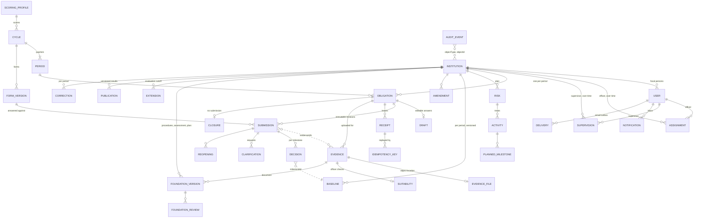
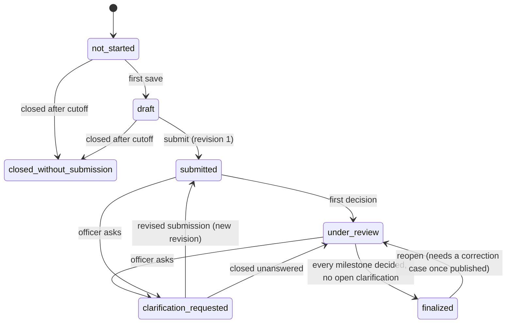

# Data model and state transitions

Status: HP2-9 · PostgreSQL is authoritative. This page explains the model; it does not repeat every column.

| Source                                                                  | What it defines                                                                                        |
| ----------------------------------------------------------------------- | ------------------------------------------------------------------------------------------------------ |
| [`apps/api/src/database/schema.ts`](../apps/api/src/database/schema.ts) | Tables, keys, constraints (Drizzle); migrations in `apps/api/drizzle/`                                 |
| [`packages/contracts/src/draft/`](../packages/contracts/src/draft/)     | Typed requests and responses (zod), validated by the API on input and by the web app on every response |
| [`packages/contracts/src/index.ts`](../packages/contracts/src/index.ts) | Error envelope `{ message, fieldErrors?, requestId?, code? }`                                          |
| [`packages/contracts/src/domain/`](../packages/contracts/src/domain/)   | Pure rules shared by the API and the mock: scoring, day counting, completeness, CSV                    |
| [`api-handover.md`](api-handover.md)                                    | Every endpoint, its roles, status codes and error codes                                                |
| [`platform-contracts.md`](platform-contracts.md)                        | Sessions, Redis, storage and the notification worker                                                   |

## Entities

Relationships only; columns are in `schema.ts`. Dashed lines are references held in JSON or by ID without a foreign key.

Not drawn: settings history (`calendar_changes`, `risk_scale_changes`), assignment suggestions, oversight comments, the email sink and the single-row `system_state` clock.

## Rules the schema enforces

- **One obligation per institution and period:** `unique(institution_id, period_id)`. Also unique: submission `(obligation, revision)`, baseline `(institution, period, version)`, form `(cycle, version)`, delivery `key`, notification `(event, recipient)`, idempotency key `(user, key)`.
- **History is append-only.** Nothing is deleted. A change adds a row and marks the old one: evidence `supersededBy`, decisions `supersededAt`, foundations `status: superseded | withdrawn`, publications `supersededBy`, baselines by `version`.
- **Every write** goes through `write(db, (tx, businessTime) => …)` (`database/db.ts`): one transaction holding the single write lock (the `system_state` row), which also supplies business time. Audit events and notification outbox rows are inserted in the same transaction as the change they describe, so they exist exactly when the change does.

## Fields that are not obvious

| Field                                                          | Meaning                                                                                                                                                                                             |
| -------------------------------------------------------------- | --------------------------------------------------------------------------------------------------------------------------------------------------------------------------------------------------- |
| `instant` columns                                              | `timestamptz`, returned as ISO strings in Nairobi time (`+03:00`).                                                                                                                                  |
| `system_state.businessTime`                                    | The simulated clock. Workflow times (`submittedAt`, `decidedAt`, deadlines) use it; security times (sessions, links, audit `actualTime`, delivery backoff) use real time.                           |
| `processed_events (runId, eventId)`                            | Clock boundaries already handled in this run. Advancing the clock twice past one boundary does nothing the second time.                                                                             |
| `assignments` / `supervisions` `validFrom`, `validTo`          | Effective intervals. The current holder has `validTo IS NULL`; scope is always computed from the current row, so reassignment takes effect on the next request.                                     |
| `foundation_versions` `effectiveFrom`, `effectiveTo`, `status` | The period a foundation document applies to. A new version supersedes the previous one; withdrawal keeps the row with a reason.                                                                     |
| `obligations.currentRevision`                                  | Latest submitted revision; `firstSubmittedAt` and `firstCompleteEvidenceAt` drive the timeliness flags and never move.                                                                              |
| `drafts.version`, `form_versions.revision`                     | Optimistic-concurrency tokens. A save sends `baseVersion`; a stale one gets `409 version_conflict`.                                                                                                 |
| `submissions.attestation`                                      | Authority attestation: the submitter confirms authority, gives a role, and either an approval reference or an explanation why none exists.                                                          |
| `submissions.evidenceIds`                                      | The evidence versions the revision relies on (the dependency). Evidence is never edited; replacing a file creates a new version with `predecessorId`.                                               |
| `decisions.milestoneId`, `revision`                            | The baseline milestone decided on and the revision assessed. `carriedForwardFrom` marks a decision confirmed from an earlier revision.                                                              |
| `suitability.checks`, `deficient`                              | Officer's evidence suitability checklist (PRD §9.2, AT30): institution, period, relevance, approval and readability, each with a passage reference. Deficient evidence cannot substantiate a claim. |
| `clarifications.windowDays`, `windowUnit`                      | The response window as issued; a later day-counting change never shortens it.                                                                                                                       |
| `baselines.historicalSeed`                                     | A simulation-only baseline loaded from history rather than proposed in the platform. An officer must confirm it before a review that relies on it can be finalized (`422 seed_unconfirmed`, AT25).  |
| `extensions.until`                                             | An authorized later evaluation cutoff for one institution.                                                                                                                                          |
| `publications.evaluation`, `points`                            | Immutable snapshot of the evaluation at release. A correction publishes a new version that supersedes it.                                                                                           |
| `receipts.receipt`                                             | Immutable receipt snapshot, served exactly as issued.                                                                                                                                               |
| `evidence.demonstration`                                       | Seeded fixture metadata with no stored bytes; served as a labelled demonstration copy. A real record with a missing object is an error, never a demonstration.                                      |

## Scores: pending is not zero

Scores are never stored as columns that could read as zero. They are computed by `domain/scoring.ts` and returned as `{ status: 'pending', reason }` or `{ status: 'calculated', fraction, points }` (points are strings, half-up to two decimals). Pending means the inputs are not decided yet, for example an unapproved baseline. Zero is a calculated result, such as a quarter closed without submission. Institution-facing responses carry no score until publication.

## Concurrency and idempotency

| Mechanism                | Where                                      | On conflict                                                             |
| ------------------------ | ------------------------------------------ | ----------------------------------------------------------------------- |
| `baseVersion`            | Draft and form saves                       | `409 version_conflict`; the client reloads and keeps the person's input |
| `revision`               | Review decisions, clarifications, finalize | `409 version_conflict` if a newer revision exists (AT10)                |
| `Idempotency-Key` header | `POST /obligations/:id/submit` (required)  | The same key returns the original receipt; no second revision (AT06)    |
| Content hash             | Evidence and foundation uploads            | The same file retried returns the existing record                       |
| Unique `key`             | Notification outbox                        | A replayed event delivers nothing new                                   |

## State transitions

### Obligation

Each submission is a new immutable `submissions` row; the obligation only points to the latest revision. Closing without submission records a `closures` row and counts as zero, not pending.

### Other lifecycles

| Record          | States                                                                          | Notes                                                                                    |
| --------------- | ------------------------------------------------------------------------------- | ---------------------------------------------------------------------------------------- |
| Form version    | `draft → published`                                                             | Published forms are fixed; a change is a new version.                                    |
| Baseline        | `proposed → approved` or `proposed → returned` (then a new version is proposed) | Approval records four checks; a returned baseline lists the failed ones (AT31).          |
| Amendment       | `pending → confirmed \| declined`                                               | Removes or reschedules a future milestone; the earlier baseline stays.                   |
| Foundation      | `active → superseded \| withdrawn`                                              | Reviews attach to a specific version.                                                    |
| Clarification   | `open → responded \| closed_unanswered`                                         | A response is the next submission revision.                                              |
| Scoring profile | `draft → approved`; seeded `reference` profiles                                 | A new simulation run can use any approved profile.                                       |
| Suggestion      | `open → applied \| dismissed`                                                   | Only an administrator resolves it.                                                       |
| Publication     | current → superseded by a correction                                            | A correction case (`corrections`) must be open for the period before reopening a review. |
| Delivery        | `queued → delivered`, or `→ retrying → delivered \| failed`                     | See [`platform-contracts.md`](platform-contracts.md#notification-delivery).              |
